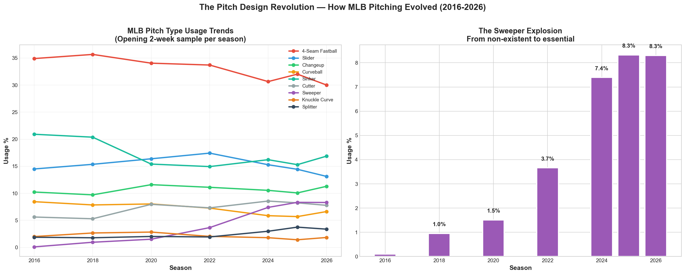
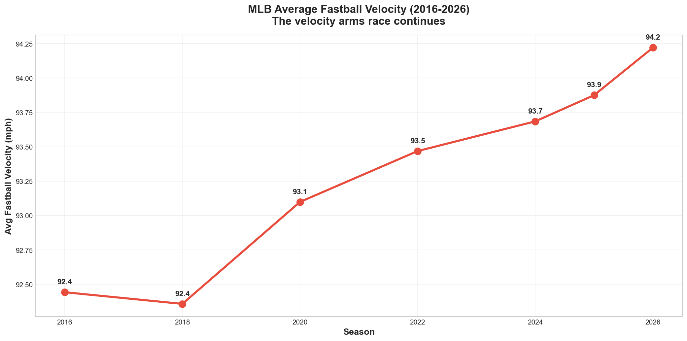
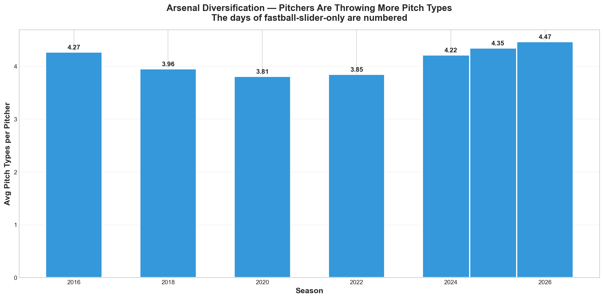

# MLB Pitch Design Revolution (2016-2026)

An analysis of how pitch design has transformed Major League Baseball over the past decade, examining the sweeper explosion, velocity inflation, and arsenal diversification trends using MLB Statcast data.

## Key Findings

### 1. Pitch Type Usage Trends

The MLB pitching landscape has undergone a dramatic transformation. The sweeper, virtually non-existent before 2020, has become one of the most commonly thrown breaking balls. Meanwhile, traditional pitch types like the curveball and sinker have declined in usage as pitchers adopt newer, more analytically optimized offerings.

### 2. The Velocity Arms Race

Average MLB fastball velocity has climbed steadily over the past decade. What was once considered elite velocity is now merely average, forcing pitchers to differentiate through movement, pitch design, and sequencing rather than raw speed alone.

### 3. Arsenal Diversification

The average number of pitch types thrown per pitcher has increased from 2016 to 2026. The era of the two-pitch pitcher (fastball-slider) is fading. Modern pitchers are expected to command 4-5 distinct offerings, each optimized for specific counts and matchups.

## Implications

These league-wide trends directly inform player development strategy:

- **For prospects like Seojun Moon (Blue Jays):** A 4-pitch mix is no longer a luxury — it's a baseline requirement. Development should focus on pitch design optimization for each offering.
- **For veteran pitchers like Kevin Gausman:** Adapting pitch mix as velocity declines is essential for career longevity. The data shows successful aging curves correlate with increased secondary pitch usage.
- **For power arms like Dylan Cease:** Even with 98 mph velocity, the highest whiff rates come from secondary pitches (Cease's changeup: ~69% whiff rate). Velocity creates advantage only when paired with effective off-speed offerings.

## Methodology

- **Data source:** MLB Statcast via pybaseball
- **Sample:** Opening two-week periods from 7 MLB seasons (2016, 2018, 2020, 2022, 2024, 2025, 2026)
- **Metrics:** Pitch type distribution, average velocity, arsenal diversity per pitcher

## Connection to Other Work

This project is part of a baseball analytics portfolio:

- **[Korean Players in MLB — A Pathway Analysis](https://github.com/seongji-park/korean-players-mlb-analysis)** — Development trajectories of Korean amateur signings
- **[Blue Jays 2026 Pitching Staff Analysis](https://github.com/seongji-park/bluejays-2026-pitching-analysis)** — Statcast analysis of Toronto's current rotation

## Author

**Seongji Park**
Statistics student | Aspiring baseball analytics professional

- GitHub: [seongji-park](https://github.com/seongji-park)
- Email: sungji0826@gmail.com